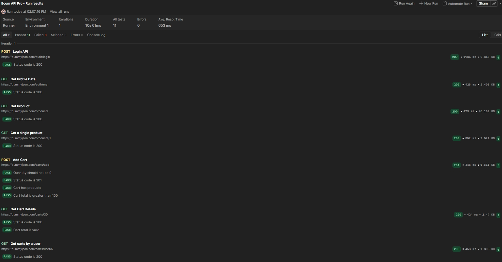

<h1 align="center">🛒 Ecommerce API Testing Project (Postman)</h1>

  🚀 End-to-End API Testing | 🔐 Auth Flow | 🧪 Automation | 🤖 AI-Assisted Testing

<h2>📌 Project Overview</h2>

This project demonstrates a complete <b>Ecommerce API Testing Workflow</b> using Postman.
It simulates a real-world business flow from <b>Login → Product Selection → Cart → Verification</b> 
with automation, scripting, and negative testing.

<h2>🔗 Base URL</h2>
<pre>https://dummyjson.com</pre>

<h2>⚙️ Step-by-Step Implementation</h2>

<h3>🟢 Step 1 - Environment Setup</h3>
<ul>
  <li>Create Environment in Postman</li>
  <li>Add variable: <b>base_url = https://dummyjson.com</b></li>
</ul>

<h3>🟢 Step 2 - Create Collection</h3>
<ul>
  <li>Create collection: <b>Ecommerce API Project</b></li>
</ul>

<h3>🟢 Step 3 - Login API</h3>
<ul>
  <li><b>POST {{base_url}}/auth/login</b></li>
  <li>Extract token using script</li>
</ul>

<h3>🟢 Step 4 - Save Token</h3>
<ul>
  <li>Use test script to store <b>token</b> in environment</li>
</ul>

<h3>🟢 Step 5 - Get User Profile</h3>
<ul>
  <li><b>GET {{base_url}}/auth/me</b></li>
  <li>Add Header: Authorization: Bearer {{token}}</li>
</ul>

<h3>🟢 Step 6 - Get Products</h3>
<ul>
  <li><b>GET {{base_url}}/products</b></li>
  <li>Save <b>product_id</b> for next request</li>
</ul>

<h3>🟢 Step 7 - Add to Cart</h3>
<ul>
  <li><b>POST {{base_url}}/carts/add</b></li>
  <li>Add product to cart</li>
</ul>

<h3>🟢 Step 8 - Save Cart ID</h3>
<ul>
  <li>Extract and store <b>cart_id</b></li>
</ul>

<h3>🟢 Step 9 - Get Cart Details</h3>
<ul>
  <li><b>GET {{base_url}}/carts/{{cart_id}}</b></li>
</ul>

<h3>🟢 Step 10 - Add Tests</h3>
<ul>
  <li>Validate response</li>
  <li>Verify cart data</li>
</ul>

<h3>🟢 Step 11 - Negative Testing</h3>
<ul>
  <li>Remove token</li>
  <li>Wrong product_id</li>
  <li>Quantity = 0</li>
  <li>Out of stock scenario</li>
</ul>

<h3>🟢 Step 12 - Run Collection</h3>
<ul>
  <li>Use <b>Collection Runner</b></li>
  <li>Automate complete flow</li>
</ul>

<h2>🔄 Business Flow Tested</h2>
<pre>
Login → Get Profile → Get Products → Select Product → Add to Cart → Verify Cart
</pre>

<h2>🧪 Sample Test Script</h2>

<pre>
pm.test("Cart total is greater than 100", function () {
    let jsonData = pm.response.json();
    pm.expect(jsonData.total).to.be.above(100);
});
</pre>

<h2>❌ Negative Test Scenarios</h2>
<ul>
  <li>Invalid / Missing Token</li>
  <li>Incorrect Product ID</li>
  <li>Quantity = 0</li>
  <li>Out of Stock Product</li>
</ul>

<h2>🤖 AI-Assisted Testing</h2>
<ul>
  <li>Generated test cases using AI prompts</li>
  <li>Example prompts:
    <ul>
      <li>Write test to validate cart total > 100</li>
      <li>What if quantity = 0?</li>
      <li>What if product is out of stock?</li>
    </ul>
  </li>
</ul>

<h2>📸 Collection Runner Results</h2>

  

<h2>💡 Key Learnings</h2>
<ul>
  <li>API Automation using Postman</li>
  <li>Environment Variables & Token Handling</li>
  <li>Request Chaining</li>
  <li>Writing Test Scripts (JavaScript)</li>
  <li>Importance of Negative Testing</li>
</ul>

<b>👉 Failures teach more than success</b>

<h2>🛠 Tech Stack</h2>
<ul>
  <li>Postman</li>
  <li>JavaScript (Postman Scripts)</li>
  <li>REST APIs</li>
</ul>

<h2>🚀 Future Improvements</h2>
<ul>
  <li>Newman CLI Integration</li>
  <li>CI/CD with GitHub Actions</li>
  <li>HTML Reports</li>
  <li>More Edge Case Testing</li>
</ul>

